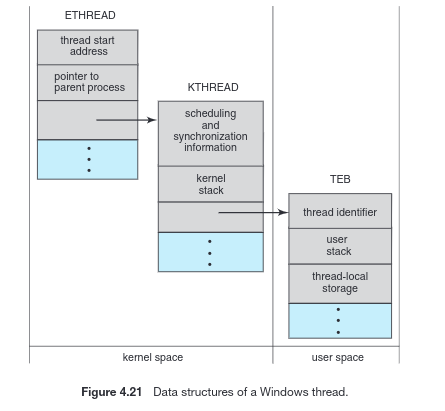

\newpage
# Capítulo 04: Threads

* A maioria dos sistemas operacionais atuais já fornece recursos que permitem que um processo contenha vários threads de controle.

## 4.1 Visão geral
* **Thread:** 
    * Unidade básica de utilização de CPU 
    * Composto por:
        * um ID de thread
        * um contador de programa
        * um conjunto de registradores
        * uma pilha
    * Compartilha com outros threads pertencentes ao mesmo processo: 
        * sua seção de código
        * a seção de dados
        * outros recursos do SO, como arquivos abertos e sinais
* **Processo pesado:**
    * Um processo tradicional, com **um único thread de controle.

### 4.1.1 Motivação
* Normalmente, uma aplicação é implementada como um processo separado com vários threads de controle.
* Exemplos:
    * Navegador Web:
        * um thread para exibir imageons ou texto e outro para recuperar dados da rede.
    * Servidor Web:
        * um thread para requisição de dados de uma página
        * se não fosse assim, poderia atender a apenas um cliente pro vez.
* A maioria dos kernels dos SOs já são multithread.
 
### 4.1.2 Benefícios 
* Os benefícios da programção com vários threads podem ser dividos em 4 categorias principais:
    * **Capacidade de resposta:** permite que um programa continue a ser executado mesmo se parte dele estiver executando uma tarefa demorada.
    * **Compartilhamento de recursos:** por default, os threads compartilham a memória e os recursos do processo ao qual pertencem.
    * **Economia:** alocação de memória e recursos para processos é dispendiosa; é mais econômico criar threads e variar apenas o contexto.
    * **Escalabilidade:** os benefícios do uso de vários threads podem ser muito maiores em uma arquitetura com mútios processadores.
 
### 4.1.3 Programação Multicore
* Programação com threads fornece um mecanismo para o uso mais eficiente de muitos núcleos de processador e o aumento da concorrência.
* Em um sistema com vários núcleos, vários threads podem ser executados paralelamente.
* 5 áreas apresentam desafios na programação para sistemas multicore:
    * **Divisão de atividades:** análise das aplicações em busca de áreas qeu possam ser divididas em tarefas concorrentes.
    * **Equilíbrio:** as tarefas devem ser executadas com esforço de mesmo valor (se uma tarefa não contribui muito para o processo, reservar um núcleo só pra ela não vale a pena).
    * **Divisão de dados:** os dados acessados e manipulados pelas tarefas devem ser dividos em núcleos separados.
    * **Dependência de dados:** deve ser analisada a depêndencia entre diferentes tarefas para garantir a sincronização.
    * **Teste e depuração.** 
* De maneira geral, há **dois tipos de paralelismo**:
    * **Paralelismo de dados**: foca em distribuir os subsets dos mesmos dados através múltiplos núcleos e em realizar a mesma operação em cada núcleo.
    * **Paralelismo de tarefas**: se trata de distribuir tarefas (_threads_) através de múltiplos núcleos.
    * Não se tratam de conceitos mutuamente exclusivos, podendo haver aplicações híbridas em alguns sistemas.

## 4.2 Modelos de Geração de Multithread
* Threads podem ser:
    * **Threads de usuário:** suportados acima do kernel e gerenciados sem o suporte deste.
    * **Threads de kernel:** suportados e gerenciados diretamente pelo SO.
* Há algumas maneiras de se estabelecer um relacionamento entre threads de kernel e de usuário.

### 4.2.1 Modelo Muitos-para-Um
* **Mapeia muitos threads de usuário para um thread de kernel.**
* O gerenciamento dos threads é feito pela biblioteca de threads no espaço do usuário.
    * **Desvantagem:** Isso faz com que o processo inteiro seja bloqueado se um thread fizer uma chamada de sistema bloqueadora, o que **diminui a concorrência**.
* Como só um thread pode acessar o kernel de cada vez, muitos threads ficarão sem ser executados.
 
### 4.2.2 Modelo Um-para-Um
* **Mapeia cada um dos threads de usuário para um thread de kernel.**
* Fornece mais concorrência do que o modelo muitos-para-um, pois permite que outro thread seja executado quando algum deles faz uma chamada bloqueadora.
* **Desvantagem:** a criação de um thread de usuário requer a criação de um thread de kernel correspondente.
* A maioria das implementaões restringe a quantidade de threads suportados pelo sistema.
* Linux e Windows implementam modelo um-para-um.
 
### 4.2.3 Modelo Muitos-para-Muitos
* **Mapeia muitos threads de usuário para uma quantidade menor ou igual de threads de kernel.**
* Não sofre com as desvantagens dos métodos acima:
    * Pode-se criar quantos threads de usuário forem necessários e os threads de kernel correspondentes podem ser executados em paralelo em um ambiente multiprocessador.
* **Modelo de dois níveis:**
    * Uma variação popular.
    * Conecta muitos threads de usuário em uma quantidade menor ou igual de threads de kernel, mas também permite que um thread de usuário seja limitado a um thread de kernel.
 
## 4.3 Bibliotecas de Threads 
* Uma **biblioteca de threads** fornece ao programador uma API para a criação e gerenciamento de threads.
* Há duas formas principais de se implementar uma biblioteca de threads:
    * Fornecer uma biblioteca inteiramente no espaço de usuário sem suporte do kernel.
    * Fornecer uma biblioteca a nível de kernel com suporte direto do SO.
* No primeiro caso, todo o código e as estruturas de dados da biblioteca existem no espaço de usuário e não possuem chamada de sistema.
* No segundo, as estruturas de dados da biblioteca existem no espaço de kernel e as chamadas da API resultam em uma chamada de sistema.
* Três bibliotecas de threads são mais usadas atualmente, detalhadas a seguir.

### 4.3.1 Pthreads
* Trata-se do padrão POSIX que define uma API para a criação e sincronização de threads.
* É uma _especificação_ para o comportamento de threads, não uma implementação.
* Vários sistemas implementão a especificação Pthreads, dentre eles: sitemas UNIX, MacOS, Linux, etc.
* _[Especificações com exemplo do uso do Pthreads no livro]_

### 4.3.2 Threads Win32
* Trata-se de uma biblioteca de nível de kernel disponível em sistemas Windows.
* _[Especificações com exemplo do uso de Threads Win32 no livro]_

### 4.3.3 Threads Java
* Trata-se do modelo básico de execução de programas Java.
* Todos os programas Java são compostos por pelo menos um thread de controle.
* Como na maioria dos casos a JVM é executada acima de um SO, geralmente a API de threads do Java utiliza uma biblioteca de threads do SO hospedeiro.
* _[Especificações com exemplo do uso de Threads Java no livro]_
 
## 4.5 Exemplos de Sistemas Operacionais
 
### 4.5.1 Threads no Windows
* Cada processo Windows tem um ou mais threads.
* Os sistemas Windows usa o mapeamento um-para-um.
* Os componentes gerais de uma thread:
    * Um ID de thread
    * Um registrador representando o status do processador
    * Um contador de programa
    * Uma pilha de usuário, usada quando a thread está rodando no modo usuário, e uma pilha kernel, quando está rodando no modo kernel.
    * Uma área de armazenamento privado, usada por várias run-time libraries e dynamic link libraries (DLLs). 
* O set de registradores, as pilhas e o armazenamento privado são conhecidos como **contexto do thread**.
* Os tipos primários de dados do thread incluem:
    * ETHREAD (Executive Thread Block)
    * KTHREAD (Kernel Thread Block)
    * TEB (Thread Enviornment Block)
* Tanto o ETHREAD quanto o KTRHEAD existem no espaço de kernel.
* **ETHREAD:**
    * A chave do ETHREAD inclui um ponteiro para o processo para o qual o thread pertence e o endereço da rotina na qual a thread começa (?) 
    * O ETHREAD também contém um ponteiro para o KTHREAD correspondente.
* **KTHREAD:**
    * Inclui uma informações de scheduling e sincronização do thread.
    * Além disso, o KTHREAD contém a pilha do kernel e um ponteiro para o TEB.
* **TEB:**
    * Trata-se de uma estrutura de dados no espaço do usuário que é acessada quando o thread está rodando no modo usuário.
    * Contém o identificador do thread, uma pilha do modo-usuário e um array para o armazenamento de thread-local.
     


### 4.5.2 Threads no Linux
* O Linux não faz distinção entre threads e processos:
    * Usa o termo **task** para ambos.
* Possui as chamadas de sistema ```fork()``` e ```clone()```.
* Quando se usa ```clone()```, é passado um set de flags que determinam o quanto de espaço deve ser compartilhado entre o pai e o filho.
* O nível variável de espaço ocupado é possível devido à forma com que o kernel do Linux representa as tasks.
    * Uma estrutura de dados do kernel(```struct task_struct```) existe para cada task no sistema e contém ponteiros para outras estruturas onde os dados estão armazenados.
