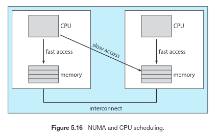

\newpage
# Capítulo 05: Scheduling da CPU

* O scheduling da CPU é a base dos SOs multiprogramados.
* Em SOs que suportam threads, são os threads de nível de kernel que são alocados à CPU pelo SO.

## 5.1 Conceitos Básicos
* Quando um processo precisa esperar, o SO desvincula a CPU deste processo e a designa para outro processo.

### 5.1.1 Ciclo de Picos de CPU-I/O
* **Ciclo da CPU**:
    * **Pico de CPU**: CPU ocupada; passa a esperar por I/O
    * **Pico de I/O**: espera por operações de I/O; passa para pico de CPU depois
* As durações de ciclos de CPU variam muito de um processo e computador para outro.
* Geralmente, a curva de um pico de CPU é caracterizada como exponencial ou hiperexponencial, com uma grande quantidade de picos curtos de CPU e pouca quantidade de picos longos.
* Normalmente, um programa limitado por I/O tem muitos picos curtos de CPU.
* Um programa limitado por CPU tem alguns picos longos de CPU.
* Essa distribuição pode ser importante na seleção de um algoritmo de scheduling da CPU.
 
### 5.1.2 Scheduler da CPU
* O processo de seleção de processo a ser executado pela CPU é executado pelo **scheduler de curto prazo**.
* Ele seleciona entre a fila de prontos.
* A fila de prontos **não** necessariamente segue um algoritmo FIFO:
    * Pode ser de prioridade, uma árvore, ou uma lista não ordenada.
* Geralmente, os registros nas filas de prontos são os PCBs.

### 5.1.3 Scheduling com Preempção
* Decisões na scheduling da CPU podem ser tomadas nas 4 situações a seguir:
    * 1. Quando um processo passa do estado de execução para o estado de espera.
    * 2. Quando um processo passa do estado de execução para o estado de pronto.
    * 3. Quando um processo passa do estado de espera para o estado de pronto.
    * 4. Quando um processo termina.
* Nas situações 1 e 4, não há alternativas
* Quando ocorre nestas situações, chamamos de **scheduling sem preempção** ou **cooperativo**.
* Nas situações 2 e 3, há alternativas, e é chamado de **scheduling com preempção**
* **Scheduling sem preempção**:
    * A CPU é alocada para um processo, esse a usa até liberá-la no seu encerramento ou ao passar para o estado de espera.
    * Usado pelo Windows 3.x.
* **Scheduling com preempção**:
    * Gera um custo associado ao acesso a dados compartilhados:
        * Exemplo: um processo está escrevendo dados, e é interceptado por outros que precisa ler tais dados inconsistentes.
    * Também afeta o projeto do kernel do SO:
        * Durante o processamento de uma chamada de sistema, o kernel pode estar ocupado com uma atividade direigida a um processo.
        * Essas atividades podem envolver a alteração de importantes dados do kernel.
        * E se o processo fosse objeto de preempção no meio das alterações do kernel e tivesse que modificar a mesma estrutura?
        * _[Soluções discutidas adiante nas seções 5.5 e 19.5]_
* Como as interrupções podem ocorrer a qualquer instante, o SO precisa proteger as seções de código afetadas por interrupções de uso simultâneo.

### 5.1.4 Despachante (dispatcher)
* Trata-se do módulo que passa o controle da CPU para o processo selecionado pelo scheduler de curto prazo.
* Envolve o seguinte:
    * Mudança de contexto
    * Mudança para modo de usuário
    * Salto para a localização apropriada do programa do usuário para que ele seja reinicializado.
* **Latência de despacho:**
    * Tempo que o dispatcher leva para interromper um processo e iniciar outro.
    * Deve ser o menor possível.

## 5.2 Critérios de Scheduling
* 5 critérios utilizados na seleção de algoritmos de scheduling:
    * **Utilização da CPU:** é desejável que a CPU o mais ocupada possível.
    * **Throughput:** quando a CPU está ocupada, trabalho deve estar sendo realizado.
    * **Tempo de turnaround:** intervalo entre o momento em que o processo é submetido e sua conclusão.
    * **Tempo de espera:** soma dos períodos gastos em espera na fila de prontos.
    * **Tempo de resposta:** tempo que vai do envio de uma solicitação até a primeira resposta ser produzida (alternativa ao tempo de turnaround).
* Desejável:
    * **Maximizar** utilização de CPU e throughput
    * **Minimizar** tempo de turnaroud, tempo de espera e tempo de resposta.
* Normalmente, otimiza-se o tempo médio.
* Alguns pesquisadores sugerem que, para sistemas de tempo compartilhado, é mais importante minimizar a _variação_ no tempo de resposta do que o tempo médio de resposta.
 
## 5.3 Algoritmos de Scheduling
* **Gráfico de Gantt**: gráfico de barras que ilustra um scheduling específico.

### 5.3.1 Scheduling "First-come, first-served" (FCFS)
* Algoritmo mais simples.
* Gerenciada por uma fila FIFO.
* **Desvantagem:**
    * O tempo médio de espera na política FCFS costuma ser bem longo.
    * Não tem preempção, particularmente problemático para sistemas de tempo compartilhado.
* Em uma situação dinâmica, por exemplo, um processo limitado pela CPU com muitos processos limitados por I/O, podemos cair em um **efeito de comboio**, já que todos os processos esperam que o processo longo saia da CPU. 

### 5.3.2 Scheduling Shortest-Job-First (SJF)
* Associa a cada processo o intervalo do próximo pico de CPU do processo (melhor nome seria "próximo pico de CPU mais curto").
* **Comprovadamente _ótimo_**, por fornecer o menor tempo médio de espera para um determinado conjunto de processos.
* Grande dificuldade: como saber a duração da próxima solicitação da CPU.
* **Não pode ser implementado no nível de scheduling de CPU de curto prazo**, pois não há uma maneira de sabermos a duração do próximo pico de CPU.
* Para prever o próximo pico de CPU, normalmente assume-se que ele é uma **média exponencial** dos intervalos medidos dos picos de CPU anteriores.
* SJF pode ou não ter preempção; a escolha é feita quando um novo processo entra na fila de prontos enquanto outro ainda está sendo executado.
    * O próximo pico de CPU de um processo recém-chegado pode ser menor do que o que está em execução.
    * Um algoritmo com preempção irá interromper o processo que está sendo executado, enquanto um sem permitirá que o processo corrente termine seu pico de CPU.
    * SJF com preempção também é chamado de **shortest-remaining-time-first scheduling**.

### 5.3.3 Scheduling por Prioridades
* As prioridades podem ser definidas interna ou externamente:
    * Prioridades **internas** usam um ou mais parâmetros mensuráveis para calcular a prioridade de um processo (limites de tempo, requisitos de memória, etc).
    * Prioridades **externas** usam um ou mais parâmetros externos ao SO, como importância do processo, tipo, etc.
* Pode ou não ter preempção.
* **Grande problema**:
    * **Bloqueio indefinido**, ou **inanição**: um processo pronto para ser executado, mas que está esperando a CPU, pode ser considerado bloqueado. Desta forma um processo de baixa prioridade pode ficar esperando indefinidamente.
    * Uma solução possível é o **envelhecimento**: a prioridade de um processo é aumentada gradualmente conforme o processo aguarda execução.

### 5.3.4 Scheduling Round-Robin
* Foi projetado especialmente para sistemas de tempo compartilhado.
* Semelhante ao FCFS, mas a preempção é adicionada para permitir que o sistema se alterne entre os processos.
* Um **quantum de tempo** é definido; a fila de prontos é tratada como uma fila circular.
* O scheduler da CPU percorre a fila de prontos, alocando a CPU para cada processo por um intervalo de até um quantum de tempo.
* Se um processo possui um pico de CPU menor do que um quantum de tempo, ele liberará a CPU voluntariamente.
* Caso contrário, o timer será desligado e causará uma interrupção no SO.
    * Uma mudança de contexto será executada e o processo será inserido ao **final** da fila de prontos.
* Nenhum processo ocupa a CPU por mais do que um quantum de tempo sucessivamente caso haja outro processo esperando.
* O desempenho do RR depende muito to tamanho do quantum de tempo.
* Queremos que o quantum de tempo seja longo em relação ao tempo de mudança de contexto.
* O tempo de turnaround também depende do tamanh odo quantum de tempo:
    * O tempo médio é melhorado quando a maioria dos processos termina seu próximo pico de CPU em um único quantum de tempo.
 
### 5.3.5 Scheduling de Filas em Vários Níveis (Multilevel Queue Scheduling)
* Criada para situações em que os processos são facilmente classificados em diferentes grupos (por exemplo, **foreground** e **background**).
* Divide a fila de prontos em várias filas separadas. 
* Os processos são atribuídos permanentemente a uma fila, geralmente com base em alguam propriedade do processo, como tamanho da memória.
* Cada fila tem seu próprio algoritmo de scheduling.
* Deve haver um scheduling entre as filas, normalmente sendo implementado como um scheduling de prioridade fixa com preempção.
 
### 5.3.5 Scheduling de Filas com Retroalimentação em Vários Níveis 
* Permite a alternância de um prcoesso entre as filas.
* A ideia é separar os processos de acordo com as características de sesu picos de CPU: se um processo usar muito tempo da CPU, passa para uma fila de prioridade mais baixa.

## 5.4 Scheduling de Threads
* Threads a nível de kernel que são alocados à CPU.
* Threads de nível de processos são gerenciados por uma biblioteca de threads, e o kernel não tem conhecimento deles.

### 5.4.1 Escopo de Disputa 
* Em sistemas muitos-para-um e muitos-para-muitos, a biblioteca de threads organiza os threads de nível de usuário para serem executados em um LWP disponível, conhecido como **escopo de disputa de processo (PCS, _process-contention scope_).**
* Para decidir que thread de kernel deve ser associada à CPU, o kernel usa o **escopo de disputa de sistema (SCS, _system-contention scope_)**.
* Normalmente, o PCS é estabelecido de acordo com prioridades configuradas pelo programador.
 
### 5.4.2 Scheduling no Pthreads
* [...]
 
## 5.5 Scheduling com Multiprocessadores
* Com vários processadores, o **compartilhamento de carga** se torna possível.
 
### 5.5.1 Abordagens para o Scheduling com Multiprocessadores
* Abordagem 1: **multiprocessamento assimétrico**
    * Em um sistema multiprocessador, todas as decisões de scheduling, o processamento de I/O e outras coisas são manipulados por um único processador, o **servidor mestre**. Os outros executam apenas código de usuário.
    * Esse **multiprocessamento assimétrico** é simples porque apenas um processador acessa as estruturas de dados do sistema.
* Abordagem 2: **multiprocessamento simétrico (SMP - _symmetric multiprocessing_)**
    * Cada processador faz seu próprio scheduling.
    * Todos os processos podem ficar em uma mesma fila de prontos ou cada processador pode ter a sua.
    * O scheduling é executado com o scheduler de cada processador examinando a fila de prontos e selecionando um novo processo para execução.
 
### 5.5.2 Afinidade com o Processador
* Caso um processo mude de processador, as caches se desatualizam.
* Devido ao alto custo da invalidação e repovoamento de caches, a maioria dos sistemas SMP tenta evitar a migração de processos de um processador a outro, o que é conhecido como **afinidade com o processador**.
* **Afinidade leve**: tenta manter um processo sendo executado no mesmo processador, mas não garante que isso será feito.
* **Afinidade forte**: permite que um processo especifique que não deve migrar para outros processadores (Linux utiliza este).
* A arquitetura da memória principal de um sistema pode afetar a afinidade com o processador:
    * Em uma arquitetura de acesso não uniforme à memória (NUMA), uma CPU tem mais facilidade para acessar partes da memória que outra.

 
### 5.5.3 Balanceamento de Carga
* O **balanceamento de carga** tenta manter a carga de trabalho uniformemente distribuída entre todos os processadores em um sistema SMP.
* Normalmente só é necessário em sistemas onde cada processador tem sua própria fila de prontos.
* Duas abordagens gerais (**não** mutamente exclusivas):
    * **Migração por expulsão:**
        * Uma tarefa específica verifica periodicamente a carga de cada processador e, quando encontra um desequilíbrio, distribui uniformemente a carga movendo processos de processadores sobrecarregados para outros menos ocupados.
    * **Migração por absorção:**
        * Ocorre quando um processador ocioso extrai uma tarefa que está esperando em um processador ocupado. 
* Geralmente, o balanceamento contraria a afinidade com o processador.

### 5.5.4 Processadores Multicore
* Sistemas SMP que usam processadores multicore são mais rápidos e baratos que processadores que utilizam vários processadores com seu próprio chip físico.
* **Queda da memória:** tempo em que um processador fica esperando os dados ficarem disponíveis na memória.
* Para remediar isso, muitos procejos de hardware recentes têm implementado núcleos processadores multithread em que dois ou mais threads de hardware são atribuídos a cada núcleo; assim, se um thread for interrompido pela queda da memória, o núcleo pode passar a outro thread.
* Duas maneiras de deixar um processador mulithread:
    * **Alta granularidade:**
        * um thread é executado em um núcleo até um evento de latência longa (como queda da memória) ocorrer.
        * com o atraso, o processador passa a outro thread.
        * porém, o custo de mudança de threads é longo, já cada mudança demanda que o pipeline de instruções seja repreenchido.
    * **Baixa granularidade:**
        * muda de thread com um nível de granulanidade muito menor (normalmente, o ciclo de uma instrução).
* Um processador multicore multithread demanda dois níveis de scheduling: um para o sistema e outro para os núcleos.

### 5.5.5 Virtualização e Scheduling
* [...]
