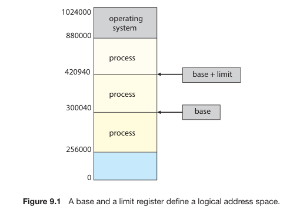
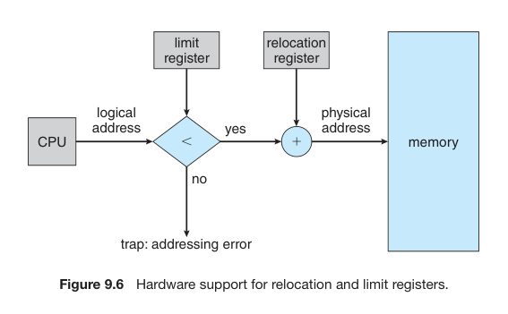
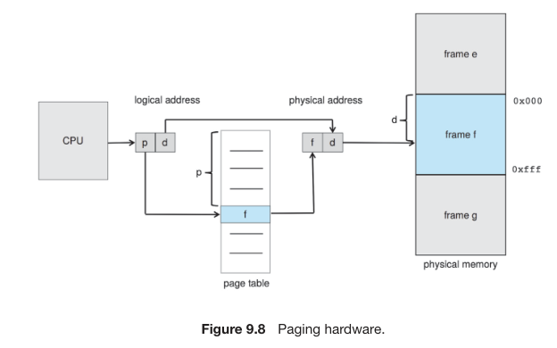
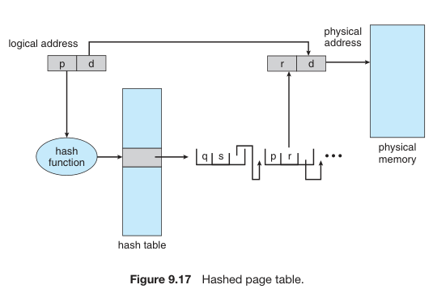
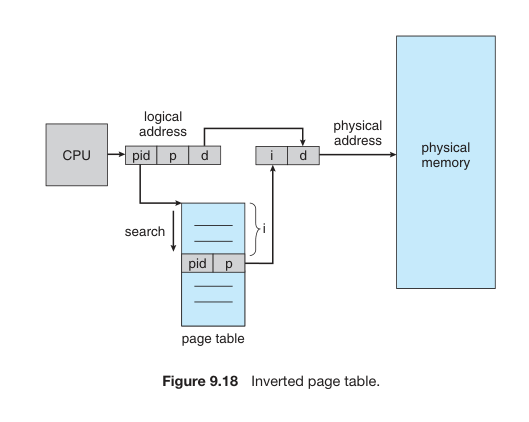

\newpage
# Capítulo 09: Main Memory

* Each memory-management approach highly dependent on the hardware.

## 9.1 Classic Problems of Synchronization
* Memory consists of a large array of bytes, each with its own address.
* The CPU fetches instructions according to the value in the Program Counter.

### 9.1.1 Basic Hardware
* Main memory and registers are the only general-purpose storage that the CPU can access directly.
    * No instructions take disk addresses as arguments.
    * All processes must be moved to the main memory in order to start execution.
* Registers built in the CPU core are usually accessable in 1 clock cycle.
    * The same cannot be said for main memory.
    * To access the main memory, the _memory bus_ must be used, and it can take several clock cycles to finish, generating a **stall**.
* To increase this process, a **cache** is used.
* **Protection**:
    * We must protect OS's by user processes access, as well user processes from others.
    * This protection is implemented in **hardware level**:
        * OS doesn't usually intervene between CPU and its memory, due to the performance penalty.
    * **1.** Each process must hava separate memory space.
    * **2.** We can provide this protection using two registers:
        * **Base register**: holds the smallest legal physical memory address
        * **Limit register**: holds the size of the range.

* Protection of memory space is accomplished by having the CPU hardware compare every address generated in user mode with the registers. 
* Any attempt by a program executing in user mode to access operating-system memory or other users’ memory results in a trap to the operating system, which treats the attempt as a fatal error. 
* This scheme prevents a user program from modifying the code or data structures of either the operating system or other users.
* The base and limit registers can only be loaded by the OS.
### 9.1.2 Address Binding
* Most systems allow a process to reside in any part of the physical memory.
* Addresses in the source program are usually symbolic, and the compiler binds them to relocatable absolute addresses.
* The binding of instructions and data memory can be done in each step:
    * **Compile time**: if you know at compiling time where the process will reside, then **absolute code** can be generated. To change this position, the program must be recompiled.
    * **Load time**: if you _don't_ know at compiling time where the process will reside, the compiler must generate a **relocatable code**, and final biding is delayed until load time.
    * **Execution time**: if the process can be moving during execution, final biding is delayed until run time. Special hardware is needed. Most OSs uses this method.
### 9.1.3 Logical vs Physical Address Space
* **Logical address**: generated by the CPU
* **Physical address**: seen by the memory unit - the one loaded into the **memory-address register**.
* Binding addresses at either compile or load time generates identical logical and physical addresses. That's not true for execution time bidings (**virtual address**).
* The run-time mapping is done by the **memory-management unit (MMU)**:
    * **Relocation register**: like the base register; its value is added to every generated address.
* **The user processes never deal with the real physical addresses.**
### 9.1.4 Dynamic Loading
* **Dynamic loading**: a routine is not loaded util it is called.
    * All routines are kept on disk in a relocatable load format. 
    * The main program is loaded into memory and is executed. 
    * When a routine needs to call another routine, the calling routine first checks to see whether the other routine has been loaded. 
    * If it has not, the relocatable linking loader is called to load the desired routine into memory and to update the program’s address tables to reflect this change. 
    * Then control is passed to the newly loaded routine.
* It is particularly useful when large amounts of code are needed.
* It does not require special support from the OS; it is user's responsibility to design their programs to take advantage of this.
### 9.1.4 Dynamic Linking and Shared Libraries 
* **Dynamic Linked Libraries (DLL)** are system libraries that are linked to user programs when the programs are run.
* Some OSs support only **static linking**, while others support **dynamic linking**.
* **Dynamic linking** are similar to dynamic loading, but linking, instead of loading is postponed until execution time.
* This feature is usually used with system libraries, such as C libraries.
* DLLs are also known as **shared libraries**, and are used extensively in Linux and Windows.
* DLLs can be extended to library updates.

## 9.2 Contigous Memory Allocation
* The memory is usually divided in two partitions: one for user's applications, other for OS.
* The OS can be placed in both lower or higher memory addresses; many operating systems (including Linux and Windows) uses higher addresses for the OS.
* We need to consider how to allocate available memory to the processes that are waiting to be brought to memory.
* **Contigous allocation**:
    * each process is contained in a single section of memory that is contigous to the section containing the next process.
### 9.2.1 Memory Protection 
* We can prevent a process from accessing memory that it does not own using a **relocation register** and a **limit register**.
* When the CPU scheduler selects a process for execution, the dispatcher loads the relocation and limit registers with the correct values as part of the context switch.
* Because every address generated by a CPU is checked against these registers, we can protect both the operating system and the other users’ programs and data from being modified by this running process.
* The relocation-register scheme provides an efficient way for the OS to change its size dynamically.

### 9.2.2 Memory Allocation
* One of the simplest methods for memory alocation is to assign processes to variably sized partitions in memory, each one containing exactly one process.
* In this **variable-partition scheme**, the OS keeps a table containing all available regions and all that are occupied.
* What if there isn't sufficient space?
    * One option is to simply reject the process.
    * Or we can put it into a wating queue.
* **Dynamic storage-allocation problem**: how to satisfy a request of size _n_ from a list of free holes. There are many solutions:
    * **first-fit**:
        * allocate the first hole that is big enough. 
        * we can stop searching as soon as we find a fit.
    * **best-fit**
        * allocate the smallest hole that is big enough. 
        * we must search the entire list. 
        * produces the smallest leftover.
    * **worst-fit**
        * allocate the largest hole
        * we must search the entire list. 
        * produces the largest leftover (which may be more useful).
* Both first fit and best fit are better than worst fit in terms of decreasing time and storage utilization.
* Neither first fit nor best fit is clearly better than the other in terms of storage utilization, but **first fit is generally faster**.
### 9.2.3 Fragmentation
* Both first-fit and best-fit suffer from **external fragmentation**.
* There is no clear winner; each one of them is best for different systems.
* **50-percent rule**: given _N_ allocated blocks, 0.5 _N_ will be lost due to fragmentation.
* **Internal fragmentation**:
    * Example: 
        * we have 18466 bytes, we allocate 18464 of them, lefting 2 bytes.
        * the overhead to keep track of this is larger than the partition itself.
    * The general approach to avoid this is to **break the physical memory into fixed-sized blocks.**
* One solution to _external fragmentation_ is **compaction**, which consists in placing all free memory in one huge block.
    * It is **not** always possible to execute compatction.
        * It is possible only if relocation is dynamic and is done in execution time.
    * Simplest algorithm: move all processes towards one end. **It can be expensive**.
    * Another solution is to permit the logical address space of processes to be noncontigous, thus allowing a process to be allocated physical memory wherever such memory is available.
    * Such strategy is used in **paging**, the most common memory-management techinique.

## 9.3 Paging
* Paging avoid external fragmentation and the need for compaction.
### 9.3.1 Basic Method
* Basic method for implementing paging involves:
    * breaking the physical memory in blocks of the same size (**frames**)
    * breaking the logical memory in blocks of the same size (**pages**)
* When a process is to be executed, its pages are loaded into any available frames from its source (a file system or a _backing store_).
* The backing store is divided into fixed-size blocks that are the same size as the memory frames.
* Every address generated by the CPU are divided into:
    * **page number (p)**:
        * used as an index in the **page table**, which contains the base address of each frame in physical memory.
    * **page offset (d)**:
        * location being referenced in the frame.

* The page size is defined by hardware, usually varying between 4Kb and 1 Gb (always as $2^n$, but usually 4Kb or 8Kb).
* While the paging scheme avoids external fragmentation, **it can still have internal fragmentation**.
* OSs can support different page sizes:
    * Windows 10 supports pages of 4Kb and 2 Mb
    * Linux has the default page size (4Kb) and an architecture dependent page (**huge pages**).
* When a process is loaded in the system to be executed, its size, in pages, is examined.
    * Each page needs one frame.
    * The first page of the process is loaded into one of the allocated frames, and the frame number is put in the page table.
* Although the programmer sees the memory as one single space, their program is scattered throughout the physical memory.
* The difference between the programmer's view and the actual memory is reconciled by the address-translation hardware.
* **Frame table**:
    * A table that the OS uses that has one entry for each physical page frame, indicating whether the later is free or allocated and, if it is allocated, to which page of which process (processes).
* **Paging increases the context-switch time**.
###9.3.2 Hardware Support
* The hardware implementation for the page table can be done in multiple ways.
* In the simplest case, can be implemented as a set of dedicated registers. 
    * it is very efficient, but increases the context-switch time.
    * it is useful if the page table is reasonably small.
* Most contemporary machines, however, has much larger pages.
    * so, the page table is kept in main memory, and a **page-table base register (PTBR)** points to the page table.
    * changing page table requires only changing only this one register, substantially reducing context-switch time.
####9.3.2.1 Translation Look-Aside Buffer
* Although storing the page table in memory can reduce context-switch time, it also can increases memory access time.
* **Translation look-aside buffer (TLB)**:
    * it is an associative, high-speed memory.
    * each entry in the TLB consists of two parts:
        * a _key_: the item is compared with all keys simultaneously.
        * a _value_: when the item is found, its value is returned.
* The TLB only contains a few of the table-page entries.
* The MMU first checks TLB; in case a **TLB miss** happens, MMU follows the default steps described before.
* If the TLB is already full, a replacement policy must be followed:
    * examples: LRU, through round-robin, random, ...
    * TLB allows some entries to be **wired down**, ie, cannot be removed.
* Some TLB store **address-space identifier (ASIDs)** in each entry.
* An ASID uniquely identifies each process and is used to provide address-space protection for that process.
* If the ASIDs do not match, it is treated as a TLB miss.
* **Hit ratio**: the percentage of times that the page number of interest is found in the TLB. 
* **Effective memory-access time**: 
    * suppose we have 80% hit ratio and it takes 10ns to access memory, then a mapped-memory access takes 10ns when the page number is in the TLB.
    * if we fail to find the page number, then we must first access memory for the page table and frame number (10ns) and then access the desired byte in memory (10ns), for a total of 20ns.
$0.80 \times 10 + 0.20 \times 20 = 12ns$
* Since CPUs today may provide multiple levels of TLBs, it is much more complicated than above to calculate memory access time.
###9.3.3 Protection
* Memory protection in a paged environment is accomplished by protection bits associated with each frame.
* One bit can define a page to be read-write or read-only.
* **Valid-invalid bit**:
    * when _valid_, the associated page is in the process's logical address space and is thus a legal (or valid) page.
    * when _invalid_, the associated page is **not** in the process's logical address space and is thus an illegal (or invalid) page.
* Illegal spaces are trapped by use of the valid-invalid bit. The OS sets this bit for each page.
* **Page-table length register (PTLR)**: indicates the size of the page table. 
###9.3.4 Shared Pages
* **An advantage of paging is the possibility of _sharing_ common code**.
* Organizing memory according to pages provides numerous benefits in addition to allowing several processes to share the same physical pages.

## 9.4 Structure of the Page Table
### 9.4.1 Hierarchical Paging
* Most modern computer systems support a large logical address space, and the page table becomes too large.
* **Forwared-mapped page table:** the page table itself is paged.
### 9.4.2 Hashed Page Tables
* One approach for handling address spaces larger than 32 bits is to use a **hashed page table**, with the hash value being the virtual page number.
* Each element consists of three fields:
    * 1. the virtual page
    * 2. the value of the mapped page frame
    * 3. a pointer to the next element in the linked list.
* Algorithm:
    * 1. the virtual page number in the virtula address is hashed into the table.
    * 2. the virtual page number is compared with field 1 in the first element in the linked list.
    * 3. If there is a match, the corresponding page frame (field 2) is used to form de desired physical address.
    * 4. Otherwise, subsequent entries in the linked list are searched for a matching virtual page number.
 

* **Clustered page tables**: 
    * useful for 64-bit address spaces.
    * similar to hashed page tables, but each entry in the hash table referes to several pages rather than one.
    * a single page-table entry can store the mappings for multiple physical-page frames.
    * particularly useful for **sparse address spaces**.
###9.4.3 Inverted Page Tables
* **Natural table representation:** Usually, each process has an associated page table.
* **Inverted page table**:
    * has one entry for each real page (or frame) of memory.
    * each entry consists of the virtual address of the page stored in that real memory location, with information about the process that owns the page.
    * thus, only one page table is in the system, and it has only one entry for each page of physical memory.
* Inverted page tables often require that an address-space identifier be stored in each entry of the page table, since the table usually contains several different address spaces mapping physical memory.
* Although this scheme decreases the amount of memory needed to store each page table, it increases the amount of time needed to search the table when a page reference occurs.
* Since the inverted page table is sorted by physical address, the whole table might need to be serached before a match is found.
    * Solution: hash table.
* Problem with inverted page tables involves shared memory.
    * with standard paging, each process has its own page table, which allows multiple virtual addresses to be mapped to the same physical address.
    * because there is only one virtual page entry for every physical page, one physical page cannot have two or more shared virtual addresses.
    * therefore, with inverted page tables, only one mapping of virtual addresses to the shared physical address may occur at any given time.
 
##9.5 Swapping

* 
