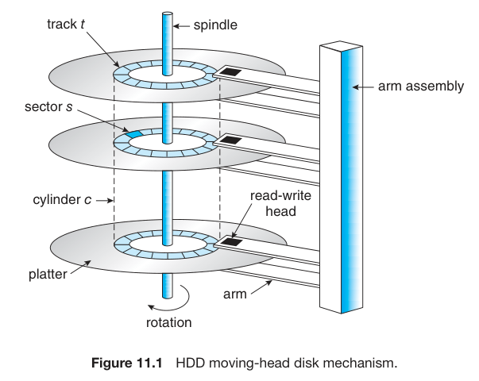
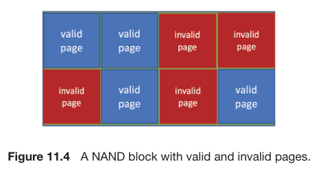

\newpage
# Capítulo 11: Mass-Storage Structure

## 11.1 Overview of Mass-Storage Structure
### 11.1.1 Hard Disk Drives 

* The surface of a platter is logically divided into circular **tracks**, which are divided into **sectors**.
* A sector size was commonly 512 bytes until 2010, but recently are migrating to 4KB.
* Rotation speed relates to **transfer rates** (the rate at which data flow between the drive and the computer):
* **Random-Access Time**: consists of two parts:
    * **seek time**: time necessary to move the disk arm to de desired cylinder.
    * **rotational latency**: time necessary for the desired sector to rotate to the disk head. 
* The disk head flies over an air cushion; the platters' surface are coated with a thin protective layer.
* A **head crash** normally cannot be repaired.

### 11.1.2 Nonvolatile Memory Devices
* **NVM** are electrical rather than mechanical.
#### 11.1.2.1 Overview of Nonvolatile Memory Devices
* Solid-state-disk (SSD), USB drive, etc.
* NVM devices can be more reliable than HDDs because they have no moving parts, can be faster because there are no seek time and rotational latency, and consume less power.
* NAND semiconductors:
    * can be read and written in the "page" increment, but they cannot be overwritten - NAND cells must be erased first.
    * **Drive Writes Per Day (DWPD)**: lifespan measure, that measures how many times the drive capacity can be written per day before the drive fails.
#### 11.1.2.2 NAND Flash Controller Algorithms
* Because NAND semiconductors cannot be overwritten once written, there are usually pages containing invalid data.
* **Flas transition layer (FTL)**: used to track which logical blocks contain valid data 
* It uses a **garbage collector**: when the SSD is full but there are still spaces holding invalid data, the good data could be copied and the invalid data, freed.
* **Over-provisioning**: NAND semiconductors usually sets 20% of the number of pages to as an area always available to write into. Data that are copied from garbage collection are written here.
 

#### 11.1.3 Volatile Memory
* RAM drives are useful as high-speed temporary storage space.

#### 11.1.5 Address Memory
* Storage devices are addressed as large one-dimensional arrays of **logical blocks**, where the logical block is the smallest unit of transfer. Each logical block maps to a physical sector or semiconductor page. The one-dimensional array of logical blocks is mapped onto the sectors of pages of the device.
* The mapping proceeds in order through the rest of the cylinders, from outermost to innermost.
* For NVM, the mapping is a tuple of chip, block, and page to an array of logical blocks.
* **Constant Linear Velocity (CLV)**:
    * used for CD-ROM and DVD-ROM drives.
    * as we move away from the inner zones, the number of sectors per track increases. 
    * the drive increases its rotation speed to keep the data rate constant.
* **Constant Angular Velocity (CLV)**:
    * used in hard disks.
    * the disk rotation speed stays constant, and the density of bits decreases from inner tracks to outer tracks to keep the data rate constant.
 
## 11.2 HDD Scheduling
* Goal: minimizing access time and maximizing data transfer bandwidth.
* **Bandwidth**: the total number of bytes transferred, divided by the total time between the first request for service and the completion of the last transfer.
* We can improve both the access time and the bandwidth by managing the order in which storage I/O requests are serviced.
* When a process needs a I/O operation, it executes a syscall with several information:
    * Whether this operation is input or output
    * The open file handle indicating the file to operate on
    * What the memory address for the transfer is
    * The amount of data to transfer
* If the desired drive and controller are available, the request can be serviced immediatly. Otherwise, any new requests are placed in a waiting queue.
* In the past, HDD interfaces required that the host to specify which track and which head to use, and much effort were spent in scheduling algorithms.
* New drivers map LBA to physical address under drive control.
* The current goals of disk scheduling includes:
    * fairness
    * timeliness
    * optimizations (such as bunching reads and writes that appear in sequence).
* Absolute knowledge of head location is impossible in modern drives.
### 11.2.1 FCFS Scheduling
* Uses FIFO algorithm
* It is fair, but usually does not provide the fastest service
### 11.2.2 SCAN Scheduling
* Sometimes called the **elevator algorithm**.
* The disk arm starts in one end and moves towards the other end, servicing requests as it reaches each cylinder, until it gets to the end of the disk.
* At the other end, the head movement reverses.
### 11.2.3 C-SCAN Scheduling
* **Circular SCAN Scheduling**: SCAN variant designed to provide a more uniform wait time.
* When the head reaches the other end, it immediatly returns to the beginning of the disk without servicing and requests on the return trip.
### 11.2.4 Selection of a Disk-Scheduling Algorithm
* SCAN and C-SCAN perform better for systems that place a heavy load on the disk, because they are less likely to cause a starvation problem.

## 11.3 NVM Scheduling
* NVMs usually use a simple FCFS policy.
* The observed behaviour of NVMs suggests that the time required to service reads are uniform but that write is not.
