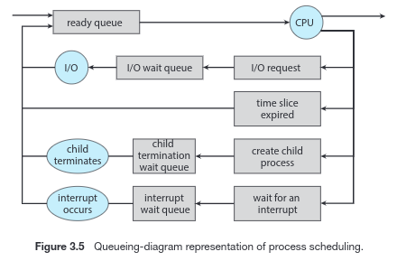
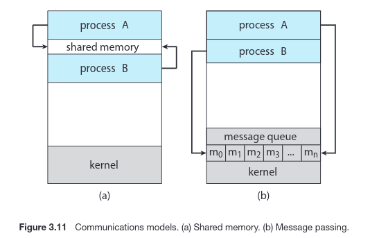

# Capítulo 03: Processos

## 3.1 Conceito de Processo 

### 3.1.1 O Processo 
* **Processo:** programa em execução.
* **Seção de texto**: código de um programa.
* Um processo inclui, além da seção de texto, o **contador do programa** e o conteúdo dos registradores do processador.
* Geralmente, um processo também inclui a **pilha** de processo, além de uma **seção de dados** (que contém os dados globais) e um **heap**.
```
---------
| pilha |
---------
|   |   |
|   v   |
|       |
|       |
|   ^   |
|   |   |
---------
| heap  |
---------
| dados |
---------
| texto |
---------
```
* Um programa por si só não é um processo:
    * Trata-se de uma entidade _passiva_ (um **executável**)
* Um processo é uma entidade _ativa_, com um _program counter_ e um conjunto de recursos associados.
* **Um programa se torna um processo quando um arquivo executável é carregado na memória**.
* Um programa pode estar associado a vários processos.
 
### 3.1.2 Estado do Processo 
* Possíveis estados de um processo (os nomes são arbitrários):
    * **Novo**: o processo está sendo criado.
    * **Em execução**: instruções estão sendo executadas.
    * **Em espera**: o processo está esperando que algum evento ocorra (operação e I/O, por exemplo)
    * **Pronto**: o processo está esperando ser atribuído a um processador.
    * **Concluído**: o processo terminou sua execução.
* Quando um processo está sendo executado, ele muda de **estado**. 
* **Somente um processo pode estar sendo executado em um processador a cada instante; porém, muitos podem estar prontos e em espera**.
* Possível caminho de estados:
    * novo -> pronto -> em execução -> em espera -> pronto -> em execução -> concluído
    * as mudanças de estados acima poderia ter sido, por exemplo:
        * Criou-se um novo processo;
        * Assume estado pronto, esperando para ser executado;
        * Após ser executado, entra em estado de espera de I/O;
        * Após a operação de I/O, assume estado pronto;
        * Entra em execução e é encerrado.
 
### 3.1.3 Bloco de Controle de Processo 
* Cada processo é representado no SO por um **bloco de controle de processo (PCB)**.
* Um PCB possui muitos trechos de informação associados a um processo específico, incluindo:
    * **Estado do processo**
    * **Contador do programa**: indica o endereço da próxima instrução
    * **Registradores da CPU**: junto com o contador do programa, as informçaões do estado devem ser salvas quando ocorrer uma interrupção.
    * **Informações da scheduling da CPU**: essas informações incluem a prioridade de um processo, ponteiros de filhas de scheduling, etc. [capítulo 5]
    * **Informações de gerenciamento da memória** [capítulo 8]
    * **Informações de contabilização**: incluem o período de tempo real e de CPU usados, os limites de tempo, números de jobs ou processos, etc.
    * **Informações de I/O**: incluem a lista de dispositivos de I/O alocados para o processo, uma lista de arquivos abertos, etc.
* Resumindo: **O PCB serve como repositório de qualquer informação que possa variar de um processo para outro.**
 
### 3.1.4 Threads
* Até o momento, consideramos apenas processos com um thread.
* Atualmente, muitos sistemas operacionais permitem que um processo tenha vários threads em execução.
* Neste caso, o PCB é estendido e possui informações sobre cada thread.
* Outras alterações no sistema como um todo também são necessárias, discutidas no _Capítulo 4_.
 
## 3.2 Scheduling de Processos
* O objetivo da multiprogramação é alternar processos com frequência tão alta que dá a impressão ao usuário que diversos processos ocorrem simultanemante.
* Em um computador com uma única CPU, nunca haverá mais de um processo sendo executado ao mesmo tempo.
* O número de processos na memória é chamado de **grau de multiprogramação** (_degree of multiprogramming_).
* Um programa normalmente é caracterizado como **CPU-bound** ou **I/O-bound**:
    * **CPU-bound**: gera processos de I/O com baixa frequência
    * **I/O-bound**: gera processos que passam maior parte do tempo com operações I/O.
* Os processos no Linux são representados por uma lista duplamente encadeada. O Kernel possui um ponteiro ```current``` para o processo corrente.

### 3.2.1 Filas de Scheduling
* Quando um processo entram em um sistema, são inseridos em uma **fila de jobs** (_jobs queue_), que contém todos os jobs do sistema.
* Se o processo está pronto, esperando para entrar em execução, é inserido na **fila de prontos** (_ready queue_), normalmente armazenada como uma fila encadeada.
* O cabeçalho de uma ready queue contém ponteiros para o primeiro e o último da PCBs da lista.
* **Fila de dispositivo**:
    * Trata-se de uma **fila de espera** (_wait queue_) de I/O de um dispositivo.
    * Cada dispositivo possui sua própria fila de dispositivo.
* **Diagrama de enfileiramento** (_queueing diagram_): Figura 01
 


### 3.2.2 Schedulers
* Em um sistema _batch_, normalmente sã osubmetidos mais processos do que é possível executar imediatamente.
* **Scheduler de longo prazo** ou **scheduler de jobs**:
    * seleciona processos do spool no disco e os carrega na memória para execução
    * controla o **grau de multiprogramação** (_degree of multiprogramming_)
* **Scheduler de curto prazo** ou **scheduler da CPU**:
    * seleciona processos que estão prontos para execução e aloca a CPU para um deles
* Principal diferença é _frequência de execução_:
    * Scheduler de CPU precisa ser executado mais frequentemente que o scheduler de longo prazo.
    * Scheduler de curto prazo: execução em milissegundos.
    * Scheduler de longo prazo: execução pode ter diferença de minutos.
* A maioria dos processos podem ser caracterizados de duas formas:
    * **Limitados pelo I/O**: gasta mais tempo executando operações de I/O.
    * **Limitados pela CPU**: gasta mais tempo executando processamento.
* Sobre o scheduler de longo prazo:
    * É importante que faça um bom **mix de processos** compostos por limitados pelo I/O ou pela CPU.
    * Quando há muitos processos limitados pelo I/O, a lista de prontos fica vazia e o scheduler de curto prazo fica ocioso.
    * Caso contrário, o scheduler de longo prazo fica ocioso o sistema fica desbalanceado.
* **O sistema de melhor desempenho terá uma combinação de processos limitados pelo I/O e pela CPU.**
* Em alguns sistemas, o scheduler de longo prazo **pode estar ausente ou ter pouca presença**. Exemplo:
    * Sistemas de tempo compartilhado, como sistemas UNIX e Windows
* Alguns SOs, como os de **tempo compartilhado**, podem inserir um nível de scheduling intermediário, chamado de **scheduler de médio prazo**.
    * A ideia chave é que é que às vezes pode ser vantajoso remover processos da memória e assim reduzir o grau de multiprogramação.
    * Desta forma, o processo é posteriormente retomado onde parou (esquema chamado de **swapping**).
    * Normalmente, swapping só é necessário quando a memória foi sobrecarregada e precisa ser liberada (discutido no _Capítulo 8_).
 
### 3.2.3 Mudança de contexto
* Quando ocorre uma interrupção, o sistema precisa salver o **contexto corrente** do processo em execução na CPU.
* O contexto é representado no PCB do processo, incluindo o valor dos registradores da CPU, o estado do processo e informações do gerenciamento de memória:
    * é executado um **salvamento de estado** corrente da CPU e depois uma **restauração de estado** ao retomar as operações.
* **A tarefa de de alocação da CPU a outro processo é conhecida como mudança de contexto**:
    * Ela exige que o sistema salve o estado do processo corrente e restaure do estado de um processo diferente.
* Os intervalos de mudança de contexto são altamente dependentes do suporte de hardware.
 
## 3.3 Operações sobre Processos 
 
### 3.3.1 Criação de Processos
* Um processo pode criar vários outros processos:
    * Processo **pai** cria processo **filho**.
    * Isso forma uma **árvore de processos**.
* A maioria dos SOs identificam os processos através de um **identificador de processos** (**pid**), normalmente um int.
* Um processo precisa de certos recursos (tempo de CPU, memória, dispositivos de I/O, etc).
* Quando um processo cria outro, este processo pode obter recursos diretamente do SO ou ficar restrito a um subconjunto dos recursos do pai.
* A restrição de um processo filho a um subconjunto dos recursosdo pai impede que algum processo sobrecarregue o sistema.
* Além dos recursos físicos e lógicos, um pai pode passar dados de inicialização (entradas) podem ser passados de pai para filho.
* Quando um processo cria outro, temos duas possibilidades em termos de execução:
    * O pai continua a ser executado concorrentemente com seus filhos.
    * O pai espera até algusn de sesu filhos ou todos eles serem encerrados.
* E há duas possibilidades quanto ao espaço de endereço do novo processo:
    * O processo filho é uma duplicata do processo pai (ele tem o mesmo programa e dados do pai)
    * O processo filho tem um novo programa carregado nele.
* _Checar livro para exemplos em um SO UNIX e em um Win32_. 
 
### 3.3.2 Encerramento de Processos
* Um processo é encerrado quando executa seu último comando e solicita ao SO que o exclua através da chaamda de sistema ```exit()```.
* Nesse momento, o processo pode retornar um valor de _status_ para o processo pai (através da chamada de sistema ```wait()```.
* Todos os recursos do processo são desalocados pelo SO.
* Um processo também pode ser encerrado por outro processo (normalmente, apenas o processo pai pode fazer isso).
* Portanto, quando um processo cria um outro, a identidade do filho é passada ao pai.
* Um pai pode encerrar a execução de um de seus filhos por várias razões:
    * O filho excedeu o uso de alguns dos recursos que recebeu.
    * A tarefa atribuída ao filho não é mais necessária.
    * O pai está sendo encerrado e o SO não permite que um filho continue (**encerramento em cascata**).
  
## 3.4 Comunicação Interprocessos 
* Processos executando concorrentemente podem ser tanto **indepententes** ou **cooperativos**:
    * **Independentes**: não compartilha dados com nenhum outro processo corrente.
    * **Cooperativos**: é afetado ou afeta outros processos sendo executados.
* Motivos para se ter processos cooperativos:
    * **Compartilhamento de informação**
    * **Acelerar processos**: para acelerar um processo, podemos dividí-lo em subtarefas (possível apenas em CPU multicore)
    * **Modularização**: dividir o sistema de maneira modular, dividindo o processo em diferentes subprocessos ou threads.
* Processos cooperativos demandam que haja **comunicação interprocessos (IPC: Interprocesses Comunication)**
* Há dois modelos fundamentais para isso: **shared-memory** ou **message-passing**.
* **Shared-Memory**:
    * uma região de memória comum é alocada para os processos, onde todos os processos que a compartilham podem interagir diretamente.
    * mais rápido que message-passing, pois utiliza uma chamada de função apenas uma vez para alocar a memória.
* **Message-Passing**:
    * uma fila de mensagens é utilizada, onde são colocadas mensagens trocadas entre os processos cooperativos.
    * melhor para lidar com menores quantidades de dados.
    * como é necessário realizar uma chamada de sistema para cada mensagem, é mais lento que a abordatem de memória compartilhada (_shared-memory_).
    * mais fácil de implementar em sistemas distribuídos.
     


## 3.5 IPC in Shared-Memory Systems [10<sup>th</sup> edition]
* Normalmente, a região de memória compartilhada está situada na região de memória do processo que criou o segmento.
* Um processo, caso queira usar uma região compartilhada de memória, deve se _attach_ a esta região de memória.
* O SO costuma impedir que um processo acesse o espaço e memória alocado a outro. Para que a memória seja compartilhada, é necessário que os processos concordem em retirar esta restrição. 
* A forma e a locação dos dados neste espaço compartilhado é responsabilidade dos processos envolvidos, e não faz parte do conhecimento do SO.
* Os próprios processos são responsáveis para garantir que não estão escrevendo ou lendo da região simultaneamente.
* Exemplo de uso: uma das soluções para **produtor-consumidor**:
    * O produtor enche um buffer de memória, que deve ser esvaziada pelo consumidor.
    * Eles devem estar sincronizados para que o consumidor não tente ler algo ainda não escrito.
    * O buffer pode ser **unbounded** (sem restrição de tamanho) ou **bounded** (com restrição de tamanho).
        * Caso seja **bounded**, o consumidor deve esperar caso o buffer esteja vazio e o produtor deve esperar caso esteja cheio.
* Mecanismos de sincronismo são discutidos nos capítulos 6 e 7.

## 3.6 IPC in Message-Passing Systems [10<sup>th</sup> edition]

